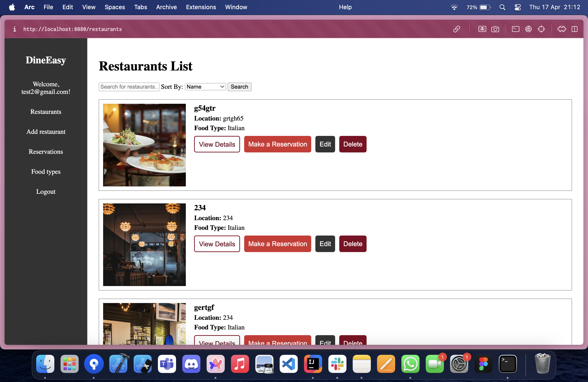
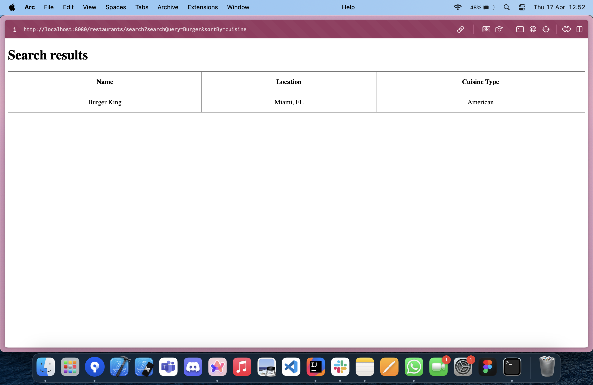

## **DineEasy**  
### **📌 About the project**  
DineEasy is an app designed for users who wish to reserve tables at restaurants in a simple and fast way. The app allows users to explore available restaurants, view the menu, book a table for a specific time slot, and receive a confirmation via email.  

---

### **🗂️ Technologies Used**
Java, Spring Boot, Spring Cloud, Spring Security, Spring Data JPA, Eureka, Spring Gateway, PostgreSQL.

---

### **🔄 Entity Relationships**

---

### **📋 Functional Requirements (Business Requirements)**  
✔ Users must be able to view available restaurants.

✔ Users must be able to select a restaurant.

✔ Users must be able to view each restaurant's menu.

✔ Users must be able to make a reservation for a specific day and time.

✔ Users must be able to choose the number of seats for the reservation.

✔ Users must receive a reservation confirmation via email.

✔ Users must be able to search for restaurants by name or location.

✔ Users must be able to filter restaurants by cuisine type (Italian, Asian, Vegan, etc.).

✔ Users must be able to cancel a reservation before the scheduled time.

✔ Restaurants must be able to view active reservations. 

---

### **🛠️ Implementation Details**  
✔ Relationships between entities will be created using: @OneToOne, @OneToMany, @ManyToOne, @ManyToMany.

✔ All types of CRUD operations will be implemented.

✔ The app will be tested with different profiles and two databases (one H2 for testing).

✔ Unit tests will be implemented.

✔ Data will be validated, and exceptions will be handled appropriately.

✔ Pagination and sorting options will be used for data.

✔ Spring Security will be included for minimal authentication with JDBC. 

---

### **⭐ Main Features**  
1️⃣ Exploring Restaurants
   - Displays the list of available restaurants.
   - Allows users to view information about restaurants (name, location, cuisine type).

2️⃣ Selecting a Restaurant and Viewing the Menu
   - Provides details about the restaurant (hours, address, reviews).
   - Displays the restaurant's menu with prices and images.

3️⃣ Making a Reservation
   - Allows users to select the day and time for the reservation.
   - Displays the number of available seats.
   - Reservation confirmation is sent via email.

4️⃣ Filtering and Searching Restaurants
   - Search by name or location.
   - Filter by cuisine type (fast food, fine dining, vegan, etc.).

5️⃣ Reservation Details
   - Users can view reservation details (restaurant, date, time, number of seats).
   - Provides the option to cancel a reservation before the scheduled time.

---

### **🔍 Pagination & Sorting**
- Uses Spring Data Pageable for listing restaurants/menus.

---

### **🔐 Security**
- Configured with Spring Security (JWT or JDBC-based login)
- Endpoints are protected accordingly
📸 Screenshot of login page or token response
📸 SecurityConfig.java file
TODO!!!!!!!!!
---

### **🧱 Microservices**

---

### **⚖️ Scalability & Load-balancing**
- Multiple instances for services (menu-service running on ports 8085 and 8087)

  

---

### **📊 Monitoring & Logging**
- Spring Boot Actuator is enabled
- Logging is implemented with SLF4J

---

### **🔄 Rezilience**
- **@CircuitBreaker** used for fallback when a service is unavailable

---

## **💡Design Patterns**
- Service Layer
- Singleton classes
- Optional handling
- Circuit Breaker = Resilience pattern